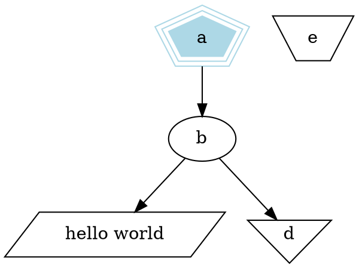
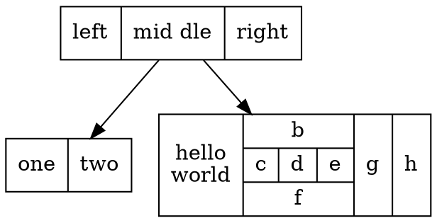
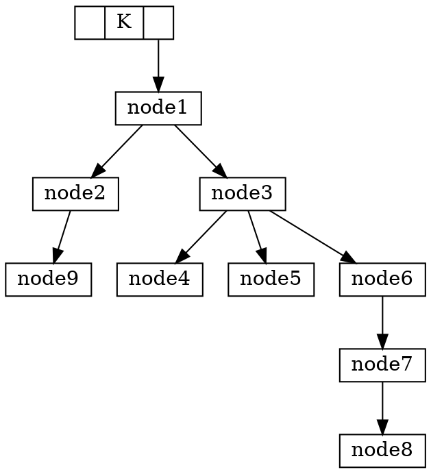

这篇文章参考自[Drawing graphs with *dot*](http://www.graphviz.org/pdf/dotguide.pdf)

$dot$ 通过$DOT$语言来作图。该语言描述了三大对象：图(graphs)，节点(nodes)，边(edges)。同时支持有向图和无向图，并支持图的嵌套($subgraph$)。
默认采用有向图的布局方式，有另一个独立的布局工具，*neato*，用于无向图。

$dot$ 编译的方式是按顺序一行一行地处理 *.dot 文件中内容。所以各种对象的属性的有效性从从属性设置语句所在行开始直到下一次属性设置语句所在行之前。

完整的属性描述可以参考$Graphviz$官网的[该页面](http://www.graphviz.org/doc/info/attrs.html)。

## 要素
一幅图可以包含如下要素：

1. 注释
  - 双斜杠
2. 有向图 or 无向图
3. 节点之间的关系
  - 有向图：`a->b`，节点 a 指向节点 b
  - 无向图：`a--b`，节点 a 和节点 b连通
4. 定义节点属性
  - 形状，多边形`polygon`和`record`（不知道怎么翻译）
  - 颜色
  - 标签
  - 等等
5. 定义边的属性
  - 形状
  - 颜色
  - 文本
  - 等等
6. 定义结构(`record`)
  - 内部结构
  - 方向，水平或竖直排列
  - 标签

## 样例


<!--  -->




